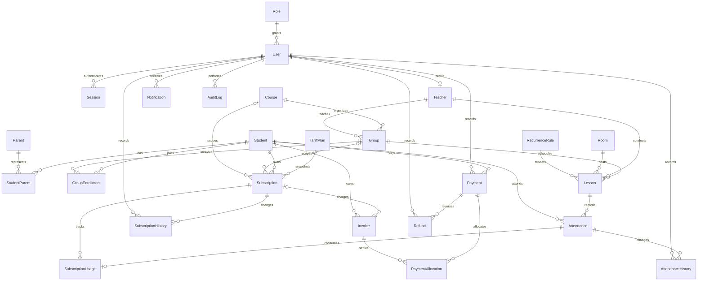

# ER-диаграмма

```mermaid
erDiagram
 Role ||--o{ User : grants
 User ||--o{ Session : authenticates
 User ||--o| Teacher : profile
 User ||--o{ Notification : receives
 User ||--o{ AuditLog : performs
 Student ||--o{ StudentParent : has
 Parent ||--o{ StudentParent : represents
 Student ||--o{ GroupEnrollment : joins
 Group ||--o{ GroupEnrollment : includes
 Course ||--o{ Group : organizes
 Teacher ||--o{ Group : teaches
 Group ||--o{ Lesson : schedules
 Teacher ||--o{ Lesson : conducts
 Room ||--o{ Lesson : hosts
 RecurrenceRule ||--o{ Lesson : repeats
 Lesson ||--o{ Attendance : records
 Student ||--o{ Attendance : attends
 Attendance ||--o{ AttendanceHistory : changes
 Attendance ||--o| SubscriptionUsage : consumes
 TariffPlan ||--o{ Subscription : snapshots
 Student ||--o{ Subscription : owns
 Group |o--o{ Subscription : scopes
 Course |o--o{ Subscription : scopes
 Subscription ||--o{ SubscriptionUsage : tracks
 Subscription ||--o{ SubscriptionHistory : changes
 Subscription |o--o{ Invoice : charges
 Student ||--o{ Invoice : owes
 Student ||--o{ Payment : pays
 Payment ||--o{ PaymentAllocation : allocates
 Invoice ||--o{ PaymentAllocation : settles
 Payment ||--o{ Refund : reverses
 User ||--o{ Payment : records
 User ||--o{ Refund : records
 User ||--o{ AttendanceHistory : records
 User ||--o{ SubscriptionHistory : records
```

Setting — независимая таблица настроек по строковому ключу. Кардинальности относятся к модели; текущий API выдаёт абонемент для конкретной группы и проводит платёж по одному счёту.
